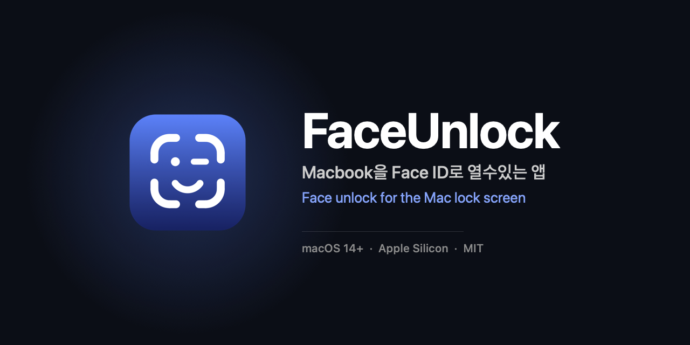

<div align="center">



### Macbook을 Face ID로 열수있는 앱
### (Touch ID 없는 맥북 유저가 직접 만든)
**Face unlock for the Mac lock screen — a menu bar app, no Xcode required.**

카메라가 얼굴을 알아보면 잠금 화면을 대신 풀어줍니다.<br>
ArcFace 임베딩 · 눈 깜빡임 확인 · 비밀번호는 Secure Enclave에 봉인.

[](https://github.com/KINN-CH/FaceUnlock/releases)
[](https://github.com/KINN-CH/FaceUnlock/releases)
[](Sources)
[](https://github.com/KINN-CH/FaceUnlock/releases/latest)
[](LICENSE)

### [⬇︎ 최신 버전 내려받기 (DMG)](https://github.com/KINN-CH/FaceUnlock/releases/latest)

**[한국어](#한국어) · [English](#english)**

<sub>`macbook-faceid` · `face-recognition` · `arcface` · `coreml` · `vision-framework` · `secure-enclave` · `swiftui` · `menu-bar-app` · `screen-unlock` · `macos`</sub>

</div>

---

<a id="한국어"></a>

<p align="center">
  <a href="#시작하기-전에">시작하기 전에</a> ·
  <a href="#설치">설치</a> ·
  <a href="#처음-설정">처음 설정</a> ·
  <a href="#동작-방식">동작 방식</a> ·
  <a href="#조용히-틀리는-것들">조용히 틀리는 것들</a> ·
  <a href="#알려진-문제">알려진 문제</a> ·
  <a href="#개발">개발</a> ·
  <a href="#모델">모델</a> ·
  <a href="#라이선스">라이선스</a>
</p>

## 시작하기 전에

이름은 비슷하지만 Apple의 Face ID와는 다릅니다. 편의 도구로 만든 것이고
보안 장치로 쓸 물건은 아닙니다. 켜기 전에 네 가지는 알고 계셔야 합니다.

**사진은 막지만 영상은 못 막습니다.** 내장 카메라는 깊이를 재지 못합니다.
Face ID가 적외선 점 3만 개로 얼굴의 입체를 읽는 것과 달리, 이 앱이 보는 건
평면 이미지 한 장입니다. 눈 깜빡임을 확인하기 때문에 인쇄된 사진으로는 열리지
않지만, 당신이 눈을 깜빡이는 영상을 휴대폰으로 재생하면 열립니다. 깊이 센서
없이 해결할 수 있는 문제가 아니라서 고칠 계획도 없습니다.

**로그인 비밀번호를 기기에 보관합니다.** macOS에는 서드파티 앱이 화면 잠금을
푸는 공개 API가 없습니다. 그래서 저장해 둔 비밀번호를 잠금 화면에 대신
타이핑하는 방식을 씁니다. 복호화할 수 있는 형태로 갖고 있어야 한다는 뜻입니다.
할 수 있는 보호는 걸어두었습니다. 대칭키는 Secure Enclave 안에서만 유도하고
(P-256 ECDH → AES-GCM), Keychain에는 암호문만 들어가며, 다른 Mac으로 옮기면
열리지 않습니다. 평문은 `String`이 아니라 `[UInt16]`으로만 다루고 쓴 직후
0으로 덮습니다. 그래도 이 Mac을 손에 넣고 로그인까지 한 상대에게는 소용이
없습니다. 잠금 화면에서 꺼내 써야 하니 생체나 암호 확인을 걸 수가 없거든요.

**FileVault 부팅 화면에서는 동작하지 않습니다.** 전원을 켜고 처음 뜨는 그
화면은 macOS가 아직 올라오기 전이라 앱이 돌 수 없습니다. 로그인한 뒤의 화면
잠금에서만 동작합니다.

**설치해도 꺼져 있습니다.** 설정에서 직접 켜야 시작합니다.

아무런 보증 없이 제공됩니다. 자세한 건 [LICENSE](LICENSE)를 보세요.

## 설치

### DMG로 설치하기

[릴리스](https://github.com/KINN-CH/FaceUnlock/releases)에서 `FaceUnlock.dmg`를
받아 엽니다. 창 안내대로 앱을 `Applications`로 드래그한 다음,
`설치 도우미 (Install Helper).command`를 우클릭해서 열면 나머지는 알아서
진행됩니다.

문제는 그 "열기"가 한 번에 되지 않는다는 겁니다. 공증(notarization)을 받지
않아서 macOS가 막고, 승인 절차를 **두 번** 밟아야 실제로 실행됩니다.

1. 설치 도우미 우클릭 → **열기** (차단됩니다)
2. 시스템 설정 → 개인정보 보호 및 보안 → 아래로 스크롤 → **그래도 열기** → 암호 입력
3. **1~2번을 한 번 더 반복합니다.** 두 번째에 실행됩니다.

두 번 해야 하는 게 정상입니다. 한 번에 열렸다면 그대로 진행하세요.
터미널 창이 뜨면 다 끝난 겁니다. 이후로는 앱 복사, quarantine 해제, 얼굴 인식
모델 내려받기와 변환까지 한 번에 진행됩니다. 모델 변환에 몇 분 걸리고,
Python 3.12가 없으면 Homebrew로 설치할지 물어봅니다.

모델을 따로 받는 건 라이선스 때문입니다. ArcFace 가중치가 InsightFace의 비상업
연구용 라이선스라 저장소에도 DMG에도 넣을 수 없어서, 설치 도우미가 공식
배포처에서 직접 받아 `~/Library/Application Support/FaceUnlock/Models/`에
넣습니다.

> 모르는 사람이 만든, 서명도 없는 앱에 이렇게까지 하는 건 원래 위험한
> 일입니다. 못 믿겠으면 소스에서 빌드하세요. 저장소를 공개해 둔 이유가
> 그것입니다.

### 소스에서 빌드하기

이쪽이 더 깔끔합니다. quarantine이 붙지 않고 서명도 안정적이라 업데이트해도
권한과 Keychain 항목이 유지됩니다.

```bash
git clone https://github.com/KINN-CH/FaceUnlock.git
cd FaceUnlock
make model      # ArcFace 내려받기 + CoreML 변환 (최초 1회, 수백 MB)
make install    # /Applications 에 설치
```

macOS 14 이상 Apple Silicon, Command Line Tools(`xcode-select --install`),
그리고 모델 변환용 Python 3.11이나 3.12가 필요합니다. coremltools가 3.13을
아직 지원하지 않아서 최신 버전으로는 변환이 안 됩니다.

## 처음 설정

메뉴바의 얼굴 아이콘에서 **설정**을 열고 위에서부터 차례로 하면 됩니다.

1. **카메라** 권한 — 얼굴 인식용
2. **손쉬운 사용** 권한 — 잠금 화면에 비밀번호를 입력하려면 필요합니다
3. **얼굴 추가** — 9가지 자세를 찍습니다. 버튼을 누를 필요는 없고, 안내대로
   고개를 돌리고 잠깐 멈추면 자동으로 찍힙니다. 순서도 상관없어서 왼쪽을
   안내하는 중에 고개를 들면 위쪽 칸이 먼저 채워집니다. 최대 3명까지 등록할 수
   있고, 9장을 다 찍고 완료를 눌러야 저장됩니다
4. **로그인 비밀번호** — 저장하기 전에 실제 비밀번호가 맞는지 확인합니다
5. **얼굴로 잠금 해제** 켜기

잘 되는지 보려면 `Ctrl`+`Cmd`+`Q`로 잠그고 **화면이 꺼질 때까지 기다렸다가**
키를 눌러 깨워보세요. 몇 초 안에 열립니다. 잠근 직후에 얼굴을 들이대도 열리지
않는 건 의도한 동작입니다 — [동작 방식](#동작-방식)을 보세요.
언어는 설정에서 시스템 따름(기본) / 한국어 / English 중에 고를 수 있습니다.

바꿀 수 있는 값은 셋입니다.

| 항목 | 기본값 | |
|---|---|---|
| 인식 엄격도 | 0.48 | 높이면 타인이 열 확률은 줄지만 본인도 자주 실패합니다 |
| 눈 깜빡임 확인 | 켜짐 | 끄면 인쇄된 사진으로도 열립니다. 켜두세요 |
| 인식 제한 시간 | 20초 | 지나면 포기하고 비밀번호 입력으로 넘어갑니다 |

**재시동해도 알아서 다시 뜹니다.** 이 앱은 떠 있지 않으면 아무 일도 하지
않으므로, **얼굴로 잠금 해제**를 처음 켤 때 로그인 항목으로 한 번 등록합니다.
그 뒤로는 설정창의 *로그인 시 자동 실행* 토글이 주인입니다 — 껐다면 다시
켜지 않습니다. 다만 재시동 직후 **첫 로그인 화면은 얼굴로 못 엽니다.** 그때는
macOS가 아직 앱을 띄우기 전이라 비밀번호를 직접 입력해야 하고, 그 뒤의 화면
잠금부터 얼굴이 동작합니다.

## 동작 방식

```
잠긴 채로 화면이 켜짐 (screensDidWake · didWake)
  → 인식 창 열림 — 카메라 시작 (창이 열려 있는 동안에만)
  → Vision 얼굴 검출 + 5점 랜드마크 (20fps)
  → 품질 게이트 (크기 · 가장자리 · 선명도)
  → 유사변환으로 112×112 정렬 + 노출 정규화 + CLAHE
  → ArcFace CoreML → 512차원 임베딩 (초당 최대 10회)
  → 등록된 얼굴과 코사인 유사도, 연속 3프레임 일치 요구
  → 눈 깜빡임 확인 → 깜빡임 직후 신원 재확인
  → 잠금 상태 재확인 → 비밀번호 주입 → Return
```

몇 가지는 일부러 그렇게 했습니다.

**주입 직전에 잠금 상태를 다시 확인합니다.** 이 앱에서 가장 중요한 부분입니다.
이미 풀린 화면에 주입하면 비밀번호가 눈앞에 그대로 타이핑되고, 열려 있던
문서나 터미널에 들어갑니다. 상태를 확인할 수 없으면 "잠기지 않음"으로 보고
주입하지 않습니다. 실패하는 쪽이 안전합니다.

**한 프레임으로는 열리지 않습니다.** 연속 3프레임이 일치해야 하고, 얼굴이
시야에서 사라지면 카운트를 0으로 되돌립니다. 인식된 다음 다른 사람으로
바꿔치는 걸 막기 위해서입니다. 같은 이유로 깜빡임이 감지된 직후에 임베딩을 한
번 더 확인합니다. 눈을 감고 있는 사이에 얼굴이 바뀔 수 있으니까요.

**카메라는 잠금을 풀 만한 순간에만 켜집니다.** 이 앱이 일해야 하는 때는
*잠긴 채로 화면이 켜지는 그 순간*뿐입니다. 그래서 "잠겨 있고 화면이 켜져
**있는가**"라는 상태가 아니라 "화면이 켜**졌는가**"라는 사건으로 판단합니다.
사건이 오면 인식 창을 열고, 성공·실패·제한 시간·화면 꺼짐 중 하나가 오면
닫습니다. **창 밖에서는 카메라도 타이머도 돌지 않습니다.** 화면이 자면 카메라도
같이 자서 프레임이 아예 오지 않으니, 그동안 아무것도 안 돌려도 잃는 게 없습니다.

검출과 깜빡임 감지는 20fps로 돌려 짧은 깜빡임을 놓치지 않고, 무거운 임베딩만
초당 10회로 제한합니다. 임베딩은 뉴럴 엔진이 아니라 CPU에서 돌립니다. 프레임당
속도는 뉴럴 엔진이 4배 빠르지만 차이가 6.6ms라 체감되지 않는 반면, 모델을 처음
올리는 시간은 1.67초 대 0.16초로 뒤집힙니다. 사건 기반이라 뉴럴 엔진은 거의
항상 차갑기 때문에, 정작 기다리게 되는 쪽이 느려집니다.

**직접 잠그면 곧바로 풀리지 않습니다.** 잠금 버튼을 눌렀다는 건 이유가 있어서
잠갔다는 뜻입니다. 그런데 잠기자마자 인식을 시작하면, 깜빡임 확인을 끈 경우
화면을 계속 보고 있는 것만으로 1초 뒤에 도로 풀립니다. 그래서 잠금 자체로는
창을 열지 않습니다. macOS가 5초쯤 뒤 화면을 끄고, 다시 쓰려고 키를 누르거나
트랙패드를 만지면 그때 창이 열립니다.

**비밀번호가 거부되면 멈춥니다.** macOS 비밀번호를 바꾼 경우처럼 잠금 화면이
저장된 비밀번호를 거부하면 자동 해제를 중단하고 재등록을 안내합니다. 틀린
비밀번호를 계속 밀어 넣으면 macOS가 입력 지연을 겁니다.

## 조용히 틀리는 것들

빌드가 통과한다고 동작이 맞는 건 아닙니다. 이 코드에는 에러 없이 조용히 틀릴
수 있는 자리가 몇 군데 있어서, 그때마다 검사를 걸어두었습니다.

| 검사 | 무엇이 틀리면 잡히나 | 실행 |
|---|---|---|
| 잠금 가드 | 풀린 화면을 잠김으로 보고 **비밀번호를 눈앞에 타이핑** | `--selftest` |
| 유사변환 잔차 | 5점 정렬 수식 오류 | `--selftest` |
| 렌더 상하 방향 | CoreImage(좌하단 원점) ↔ 비트맵(좌상단 원점) 뒤집힘 | `--selftest` |
| 전처리 교차 검증 | RGB/BGR 뒤바뀜, NCHW/NHWC 착각, 정규화 상수 오류 | `make xcheck` |
| 모델 변환 게이트 | 레이어 누락, transpose 실수, 양자화 손실 | `make model` |

아래 셋이 특히 그렇습니다. CoreML은 채널 순서를 바꿔 넣어도 군말 없이 512차원
벡터를 돌려주고, 증상은 "얼굴은 잡히는데 절대 일치하지 않는다"로만 나타납니다.
원인을 찾는 데 한참 걸립니다.

현재 측정값은 전처리 교차 검증 `cos = 0.9987`(편차 2.92°), 모델 변환 FP32
`cos = 1.000000`, FP16 `cos = 0.9976`(3.95°)입니다. 판정 임계 0.48이 각도로
약 61°라 이 정도 편차는 무시할 수준입니다.

## 알려진 문제

**새 버전을 처음 실행하면 30초쯤 멈춥니다.** 키체인 확인 창이 뜨는데, 여기서
'항상 허용'을 누르면 그 뒤로는 즉시 뜹니다. 키체인 항목의 접근 허용 목록이
앱의 cdhash로 적히기 때문에 빌드가 바뀔 때마다 한 번씩 다시 물어봅니다. Team
ID 없이는 우회할 방법이 없습니다.

**ad-hoc 서명은 다시 빌드할 때마다 손쉬운 사용 권한이 무효가 됩니다.** ad-hoc
서명의 지정 요구사항은 바이너리 해시 그 자체(`cdhash H"b5e93fc5e2..."`)입니다.
코드를 한 줄만 고쳐도 해시가 바뀌어 권한이 무효가 되는데, 시스템 설정 목록에는
체크된 채로 남아 있어서 더 헷갈립니다. `AXIsProcessTrusted()`만 조용히 `false`를
돌려줍니다.

한 번만 실행하면 해결됩니다.

```bash
./scripts/make_signing_cert.sh
```

코드서명용 자체 서명 인증서를 만들어 요구사항을 신원 기반으로 바꿉니다.
인증서가 그대로인 한 몇 번을 다시 빌드해도 권한이 유지됩니다. Apple Developer
Program 없이 무료입니다. `make`가 이 인증서를 자동으로 찾아 쓰고, 없으면
ad-hoc으로 서명하면서 경고합니다. 이미 무효가 된 뒤라면 시스템 설정 → 손쉬운
사용에서 FaceUnlock을 `−`로 지우고 다시 추가해야 합니다. 체크만 껐다 켜는
걸로는 낡은 항목이 갱신되지 않습니다.

그 밖에 외장 웹캠보다 내장 카메라를 우선하고, 아주 어두운 방에서는 인식이
실패합니다. 화면 불빛만으로도 대체로 되지만 안 되면 비밀번호로 로그인하면
됩니다.

## 개발

```bash
make debug        # 빌드 + 서명
make run          # 빌드 후 실행
make log          # 로그 스트림 (비밀번호와 임베딩은 절대 찍지 않습니다)
make aligntest && ./build/aligntest --selftest    # 안전 가드 · 정렬 기하 · 상하 방향
make xcheck       # Swift 전처리 ↔ 원본 ONNX 교차 검증
./build/aligntest a.jpg b.jpg                     # 두 사진의 유사도 비교
make release      # 최적화 빌드
make dmg          # 배포용 DMG
```

`--selftest`는 사진 없이 돌아갑니다. CoreImage와 비트맵 사이에서 상하가 한 번
뒤집히면 임베딩이 조용히 망가지는데 에러는 나지 않아서, 그걸 자동으로 잡으려고
만들었습니다.

## 모델

얼굴 임베딩은 InsightFace의 ArcFace(`buffalo_l` / `w600k_r50`)를 씁니다.
비상업 연구용 라이선스라 저장소와 배포물에는 넣지 않고,
[InsightFace 공식 릴리스](https://github.com/deepinsight/insightface/releases/tag/v0.7)에서
직접 받아 CoreML로 변환합니다.

이 제한은 쓰는 사람에게도 그대로 적용됩니다. 개인적으로 쓰는 건 문제없지만,
회사에서 지급한 기기나 업무 목적의 사용은 '비상업 연구용' 범위를 벗어날 수
있습니다. 그런 경우라면 먼저 라이선스를 확인해 보세요.

변환 스크립트는 PyTorch 출력과 CoreML 출력의 코사인 유사도가 0.999 이상일
때만 통과시킵니다. 여기서 어긋나면 인식이 통째로 무의미해집니다.

## 라이선스

[MIT](LICENSE). 모델 가중치는 별개이며 InsightFace의 라이선스를 따릅니다.

잠금 해제 메커니즘은 [Sapphire](https://github.com/cshariq/Sapphire)의 Face ID
기능에서 동작 원리를 참고했습니다. 코드는 가져오지 않고 직접 구현했습니다.

---

<div align="center">

<a id="english"></a>

### English

</div>

<p align="center">
  <a href="#before-you-turn-it-on">Before you turn it on</a> ·
  <a href="#install">Install</a> ·
  <a href="#first-time-setup">First-time setup</a> ·
  <a href="#how-it-works">How it works</a> ·
  <a href="#the-things-that-fail-quietly">Fails quietly</a> ·
  <a href="#known-problems">Known problems</a> ·
  <a href="#development">Development</a> ·
  <a href="#model">Model</a> ·
  <a href="#license">License</a>
</p>

## Before you turn it on

The name is close, but this is not Apple's Face ID. It's a convenience tool,
not a security control. Four things to know before you switch it on.

**It stops photos, not videos.** A built-in webcam can't measure depth. Face ID
reads the shape of your face with 30,000 infrared dots; this app sees one flat
image. It asks you to blink, so a printed photo won't open it — but a video of
you blinking, played back on a phone, will. That isn't fixable without a depth
sensor, so there's no plan to fix it.

**Your login password lives on the machine.** macOS gives third-party apps no
public API for unlocking the screen, so this types the stored password into the
lock screen for you. Which means it has to be kept in a form that can be
decrypted. The protections that were available are in place: the symmetric key
is derived only inside the Secure Enclave (P-256 ECDH → AES-GCM), only the
ciphertext goes into the Keychain, and moving it to another Mac makes it
unreadable. The plaintext is handled as `[UInt16]` rather than `String` and
zeroed right after use. None of that helps against someone who has this Mac and
is logged into it — the password has to be usable from the lock screen, so it
can't be gated behind biometrics or a passphrase.

**It doesn't work at the FileVault boot screen.** That screen appears before
macOS is up, so no app can run there. This only covers the lock screen after
you've logged in.

**It ships off.** You have to turn it on in Settings.

Provided with no warranty of any kind. See [LICENSE](LICENSE).

## Install

### From the DMG

Download `FaceUnlock.dmg` from
[Releases](https://github.com/KINN-CH/FaceUnlock/releases) and open it. Drag the
app to `Applications` as the window shows, then right-click
`설치 도우미 (Install Helper).command` and choose Open. The helper does the rest.

The catch is that "Open" doesn't work on the first try. The app isn't notarized,
so macOS blocks it, and you have to approve it **twice**.

1. Right-click the install helper → **Open** (it gets blocked)
2. System Settings → Privacy & Security → scroll down → **Open Anyway** → password
3. **Repeat steps 1–2 once more.** The second attempt actually runs.

Twice is normal here. If it opened on the first try, just carry on. Once a
Terminal window appears you're done — it copies the app, clears the quarantine
flag, downloads and converts the face model, and launches FaceUnlock. The
conversion takes a few minutes, and if Python 3.12 is missing it offers to
install it with Homebrew. The helper speaks English unless your Mac is set to
Korean.

The model is downloaded separately for licensing reasons. The ArcFace weights
are under InsightFace's non-commercial research license, so they can't ship in
the repo or the DMG; the helper fetches them from the official release and puts
them in `~/Library/Application Support/FaceUnlock/Models/`.

> Going through all that for an unsigned app from a stranger is a genuinely
> risky habit. If you'd rather not, build from source. That's why the repo is
> public.

### From source

This is the cleaner path. No quarantine flag, and a stable signature, so
permissions and Keychain entries survive updates.

```bash
git clone https://github.com/KINN-CH/FaceUnlock.git
cd FaceUnlock
make model      # download ArcFace + convert to CoreML (once, a few hundred MB)
make install    # install into /Applications
```

You'll need macOS 14 or later on Apple Silicon, Command Line Tools
(`xcode-select --install`), and Python 3.11 or 3.12 for the conversion —
coremltools doesn't support 3.13 yet.

## First-time setup

Open **Settings** from the face icon in the menu bar and work down the list.

1. **Camera** permission — for recognition
2. **Accessibility** permission — needed to type the password into the lock screen
3. **Add a face** — nine poses. You don't press anything: follow the prompt,
   hold still for a moment, and it captures on its own. Order doesn't matter, so
   if you tilt your head up while it's asking for left, the up slot fills first.
   Up to three people; nothing is saved until you've taken all nine and pressed
   Done
4. **Login password** — verified against the real one before it's stored
5. Turn on **Unlock with face**

To try it, lock with `Ctrl`+`Cmd`+`Q`, **wait for the display to turn off**,
then press a key to wake it — it opens within a few seconds. Showing your face
right after locking deliberately does nothing; see [How it works](#how-it-works).
Language follows the system by default; Korean and English can be picked in
Settings.

Three settings are adjustable.

| Setting | Default | |
|---|---|---|
| Match strictness | 0.48 | Higher means strangers are less likely to get in, and so are you |
| Blink check | On | Off means a printed photo opens it. Leave it on |
| Recognition timeout | 20s | After that it gives up and hands over to the password field |

**It comes back on its own after a restart.** The app does nothing unless it is
running, so the first time you turn **Face unlock** on it registers itself as a
login item, once. After that the *Launch at login* toggle in Settings is in
charge — if you turn it off, it stays off. Note that the **first login screen
after a restart cannot be opened by face**: macOS has not launched the app yet,
so type your password there. Every screen lock after that works.

## How it works

```
display wakes while locked (screensDidWake · didWake)
  → recognition window opens — camera starts (only while the window is open)
  → Vision face detection + 5-point landmarks (20fps)
  → quality gate (size · edge margin · sharpness)
  → similarity transform to 112×112 + exposure normalization + CLAHE
  → ArcFace CoreML → 512-d embedding (10/s max)
  → cosine similarity against enrolled faces, 3 consecutive frames required
  → blink check → re-verify identity right after the blink
  → re-check the lock state → inject password → Return
```

A few decisions here were deliberate.

**The lock state is re-checked immediately before injection.** This is the most
important line in the app. Injecting into a screen that's already unlocked types
your password in plain sight, into whatever document or terminal was open. If
the state can't be read, it's treated as *not locked* and nothing is typed.
Failing is the safe direction.

**One frame is never enough.** Three consecutive frames have to match, and the
counter resets to zero the moment the face leaves the view — that's what stops
someone being swapped in after a match. For the same reason the embedding is
verified once more right after a blink is detected, since the face could change
while the eyes are shut.

**The camera only runs when an unlock is actually possible.** The one moment
this app has work to do is *the display waking while the screen is locked*. So
the trigger is the event — "did the display wake?" — not the state, "is a
display awake?". The event opens a recognition window; success, failure, the
timeout, or the display sleeping closes it. **Outside that window no camera and
no timer runs at all.** Nothing is lost by sitting idle: when the display sleeps
the camera sleeps with it and stops delivering frames anyway.

Detection and blink tracking run at 20fps so short blinks aren't missed; only
the expensive embedding is capped at 10 per second. That embedding runs on the
CPU rather than the Neural Engine. Per frame the Neural Engine is 4× faster, but
that's a 6.6ms difference nobody can feel — while loading the model cold is
1.67s against 0.16s, and with an event-driven window the Neural Engine is almost
always cold. The part you actually wait for is the part it loses.

**Locking the screen yourself doesn't unlock it a second later.** Reaching for
the lock button means you had a reason. But if recognition starts the instant it
locks, then with the blink check turned off simply continuing to look at the
screen reopens it about a second later. So the lock itself doesn't open a
window. macOS turns the display off a few seconds later, and the window opens
when you come back and press a key or touch the trackpad.

**A rejected password stops everything.** If the lock screen refuses the stored
password — after you change it in macOS, say — automatic unlocking is disabled
and you're prompted to re-enroll it. Repeatedly pushing a wrong password makes
macOS start adding delays.

## The things that fail quietly

A build that compiles isn't a build that's correct. There are a few places in
this code that can be wrong without raising an error, so each has a check.

| Check | What it catches | Run |
|---|---|---|
| Lock guard | Treating an unlocked screen as locked and **typing the password in plain sight** | `--selftest` |
| Transform residual | A mistake in the 5-point alignment math | `--selftest` |
| Render orientation | CoreImage (bottom-left origin) ↔ bitmap (top-left origin) flip | `--selftest` |
| Preprocessing cross-check | RGB/BGR swap, NCHW/NHWC mix-up, wrong normalization constants | `make xcheck` |
| Conversion gate | Dropped layers, a bad transpose, quantization loss | `make model` |

The last three matter most. CoreML happily returns a 512-d vector even when the
channel order is wrong, and the only symptom is "it finds faces but never
matches anyone" — which takes a long time to trace back.

Current numbers: preprocessing cross-check `cos = 0.9987` (2.92° off), model
conversion `cos = 1.000000` in FP32 and `0.9976` (3.95°) in FP16. The match
threshold of 0.48 is about 61° in angle, so that much drift is irrelevant.

## Known problems

**The first launch of a new build stalls for about 30 seconds.** A Keychain
prompt appears; choose "Always Allow" and it's instant from then on. The access
list on a Keychain item is recorded by the app's cdhash, so every changed build
gets asked once. There's no way around it without a Team ID.

**Ad-hoc signing invalidates Accessibility permission on every rebuild.** The
designated requirement of an ad-hoc signature is the binary hash itself
(`cdhash H"b5e93fc5e2..."`). Change one line and the hash changes and the
permission is void — while the checkbox in System Settings stays checked, which
makes it worse. Only `AXIsProcessTrusted()` quietly returns `false`.

Running this once fixes it.

```bash
./scripts/make_signing_cert.sh
```

It creates a self-signed code-signing certificate, which switches the
requirement to an identity-based one. As long as the certificate stays put,
permissions survive any number of rebuilds. Free, no Apple Developer Program
needed. `make` finds and uses the certificate automatically, and warns when it
falls back to ad-hoc. If the permission is already void, remove FaceUnlock from
System Settings → Accessibility with `−` and add it again — unchecking and
rechecking doesn't refresh the stale entry.

Beyond that: the built-in camera is preferred over external webcams, and
recognition fails in a very dark room. Screen glow is usually enough; if it
isn't, type the password.

## Development

```bash
make debug        # build + sign
make run          # build and launch
make log          # log stream (passwords and embeddings are never logged)
make aligntest && ./build/aligntest --selftest    # safety guard · alignment · orientation
make xcheck       # Swift preprocessing ↔ original ONNX cross-check
./build/aligntest a.jpg b.jpg                     # compare two photos
make release      # optimized build
make dmg          # distributable DMG
```

`--selftest` runs without any photos. A single vertical flip between CoreImage
and the bitmap silently ruins every embedding without raising an error, so this
exists to catch it automatically.

## Model

Face embeddings come from InsightFace's ArcFace (`buffalo_l` / `w600k_r50`).
The non-commercial research license keeps it out of the repo and out of
releases, so it's downloaded from the
[official InsightFace release](https://github.com/deepinsight/insightface/releases/tag/v0.7)
and converted to CoreML locally.

That restriction follows you, not just the repo. Personal use is fine, but a
company-issued machine or anything work-related may fall outside "non-commercial
research purposes" — check the license first if that's you.

The conversion script only passes when PyTorch and CoreML outputs agree to a
cosine similarity of 0.999 or better — drift here makes the whole pipeline
meaningless.

## License

[MIT](LICENSE). The model weights are separate and follow InsightFace's license.

The unlock mechanism follows the approach used by
[Sapphire](https://github.com/cshariq/Sapphire)'s Face ID feature. No code was
taken; it's a clean reimplementation.

---

## 상표 · Trademarks

Apple, Mac, MacBook, Face ID, Touch ID는 Apple Inc.의 상표입니다.
이 프로젝트는 Apple Inc.와 아무런 제휴·후원·보증 관계가 없습니다.

Apple, Mac, MacBook, Face ID and Touch ID are trademarks of Apple Inc.
This project is not affiliated with, sponsored by, or endorsed by Apple Inc.
